# AgentDVR-5.1.6.0-File-Upload-and-Remote-Code-Execution

CVE-2024-22515 arbitrary file upload and CVE-2024-22514 remote code execution for AgentDVR 5.1.6.0 (Authenticated)

(Older versions likely affected)

https://www.ispyconnect.com/

https://www.ispyconnect.com/docs/agent/about

Tested on 4.7.3.0 and 5.1.6.0. Versions in between and older are also likely impacted. Tested on installs for Windows x64, Linux x64, and Docker. It is worth noting that the exploitation path for Windows varies slightly. Intead of calling bash, you can just call an exe file directly, such as "/AgentDVR/sounds/payload.exe".

AgentDVR version 5.1.6.0 contains two vulnerabilities: an arbitrary file upload vulnerability, and a arbitrary file execution vulnerability. These both chain together to achieve execution of any arbitrary file uploaded, including malicious payloads. This results in possible RCE from individuals with valid credentials for an AgentDVR server.

Due to the nature of the program, which largely uses WebRTC, I did not make a PoC script. However, the manual process is very low in complexity. If someone makes a PoC script and contacts me, I will link it here.

First, after logging into the dashboard, add a new device. Create just a "Dummy" device with default settings.

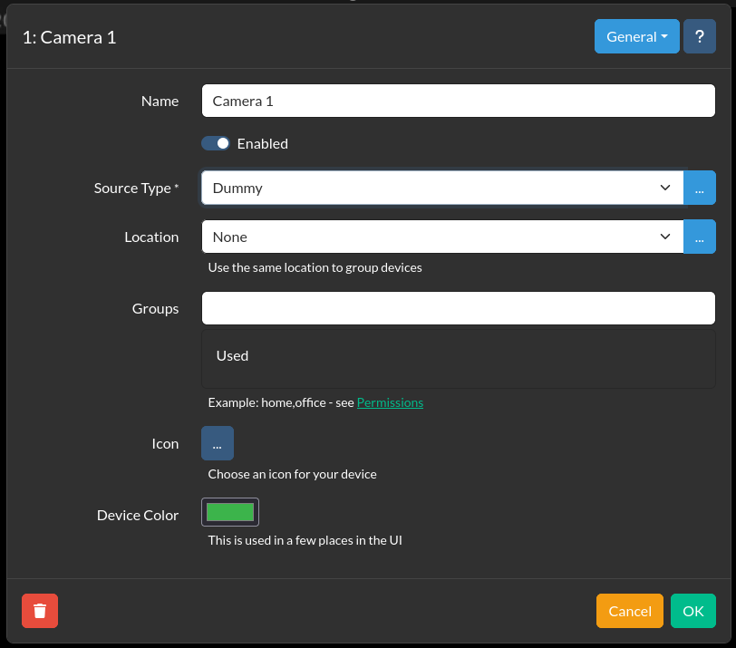

On the device, add an action to trigger a task if a photo is taken. Then, add a task, and select to "Execute Command" and select any "File" in the dropdown for what command to trigger.

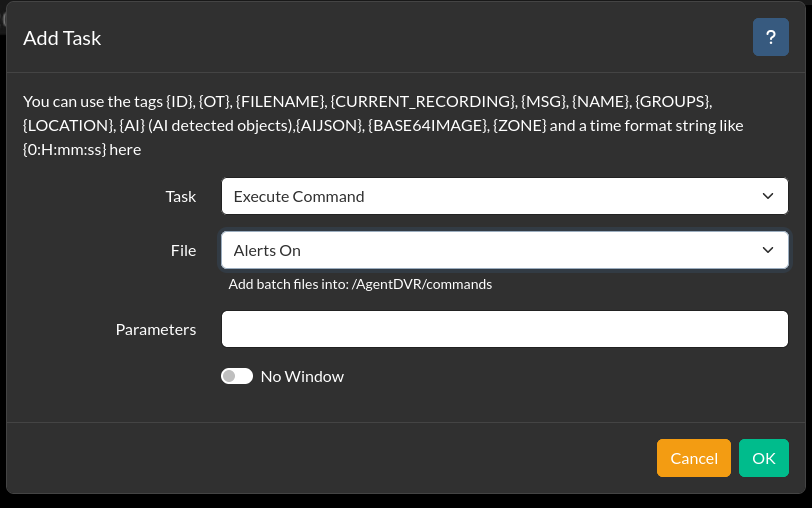

Now, prepare your payload. You can modify and use the "payload.sh" file in this repository. It is a very simple reverse shell script.

After it is ready, go back to the server menu, and select "File Upload". Select "Audio", and begin browsing for the file, but switch the file selector dropdown from "*.wav" to "All Files".

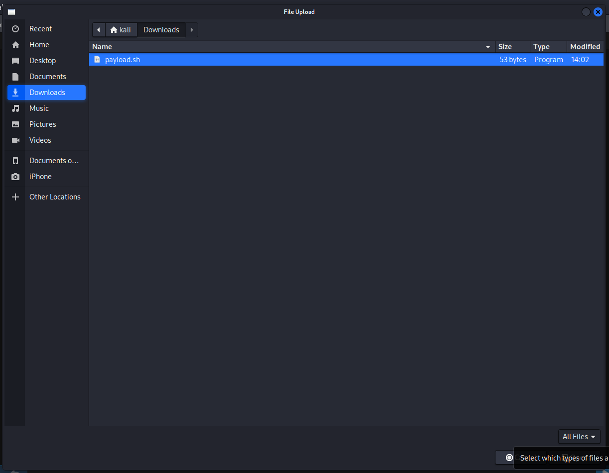

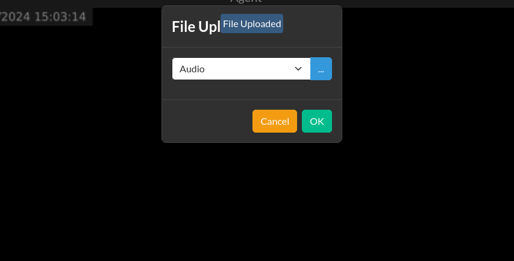

Next, go back to the server menu, and select "Backup/Restore". Select "Download". You will receive a zip file containing a few different .XML files.

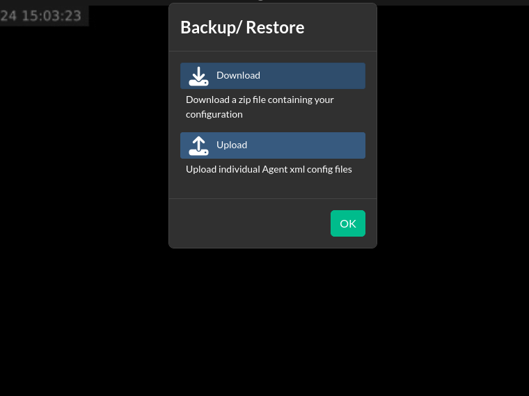

Extract the contents and open up the "config.xml". Near the bottom you will find a line similar to '<Directory Entry="/path/to/media/"'. This is important as it is the folder structure for the AgentDVR installation, which can come in a couple different forms, depending on the installation type.

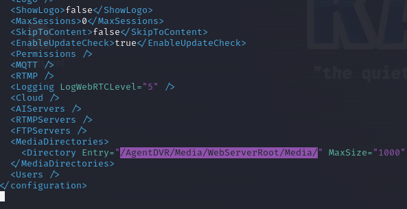

Next, edit the objects.xml file, and find a line near the bottom similar to '<entry type="EXE" param1='. Edit the path, which should be calling a default alert bat file, and insert a path calling bash to then call your .sh script. You can model the path from the previous step so you know what to insert.

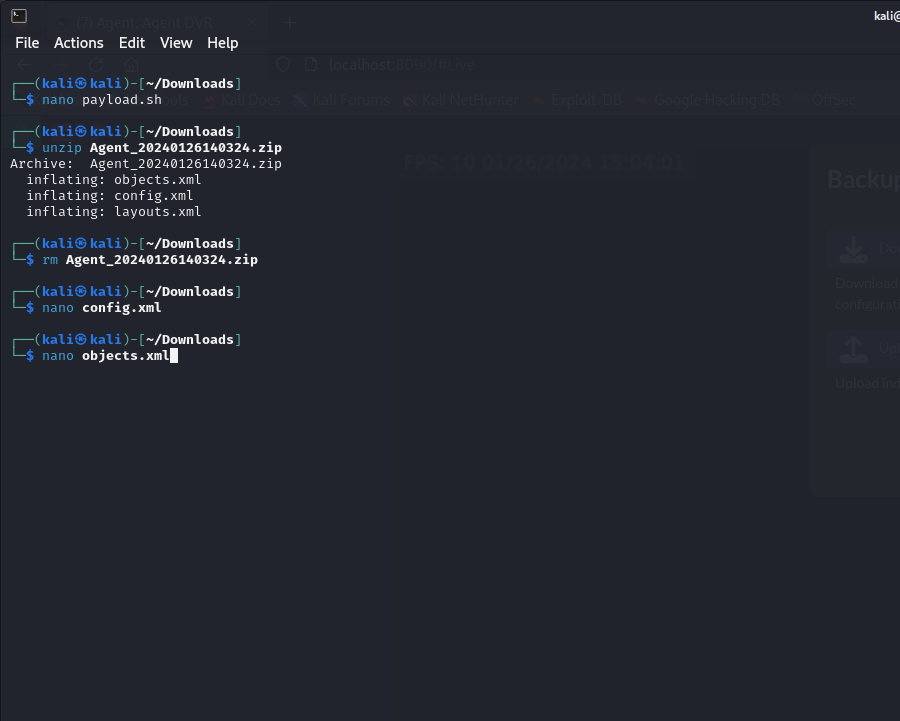
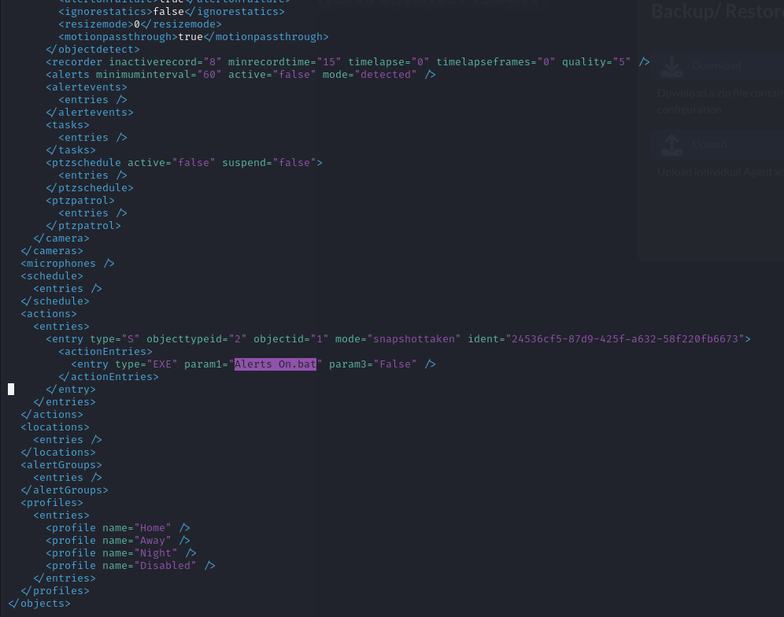
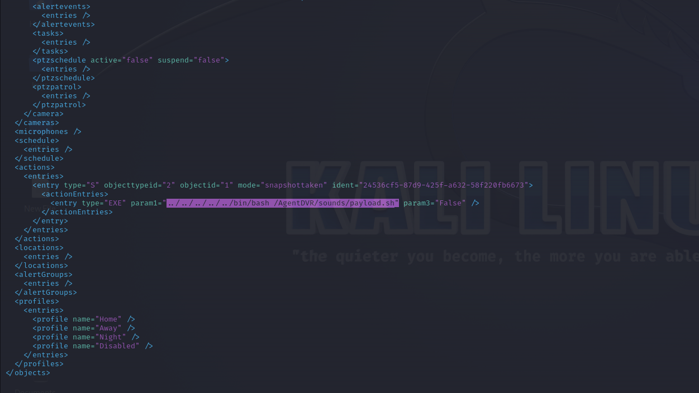

After this, you can go ahead and start your listener.

Now, go back to the server menu, and select "Backup/Restore" again. This time, choose to upload a file, and select your modified "objects.xml" file.

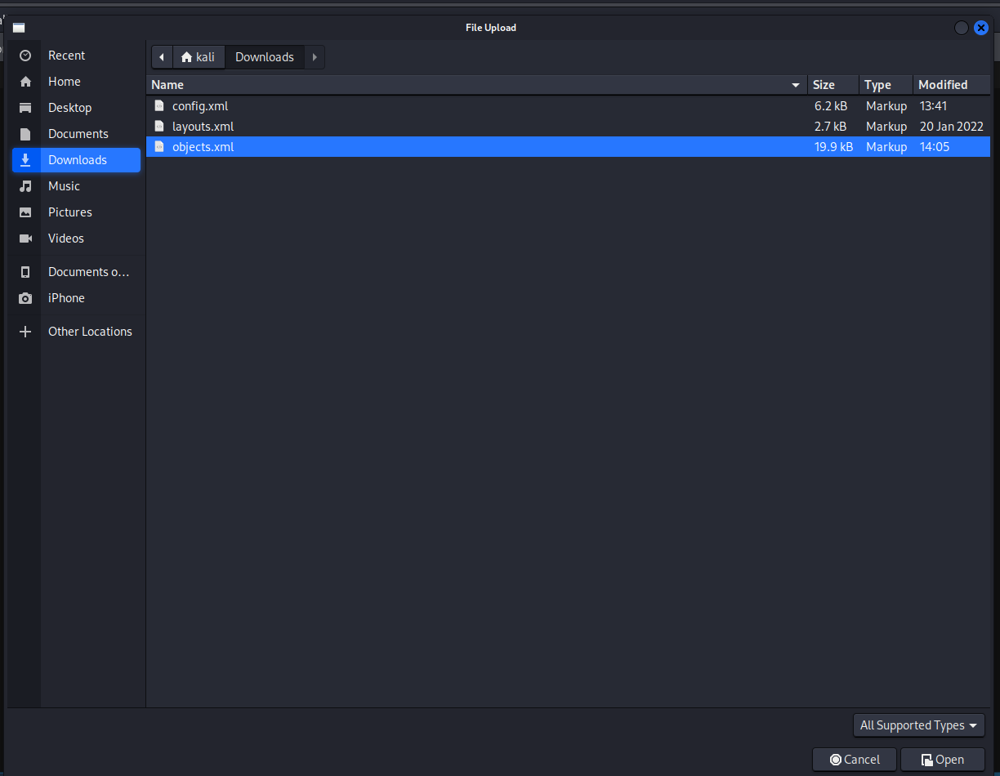

The dashboard should restart with the changes. Now, in theory, you should have a dummy camera with an alert to trigger your reverse shell script when a photo is taken. With your listener started, right click the dummy camera feed, and select "Take Photo".

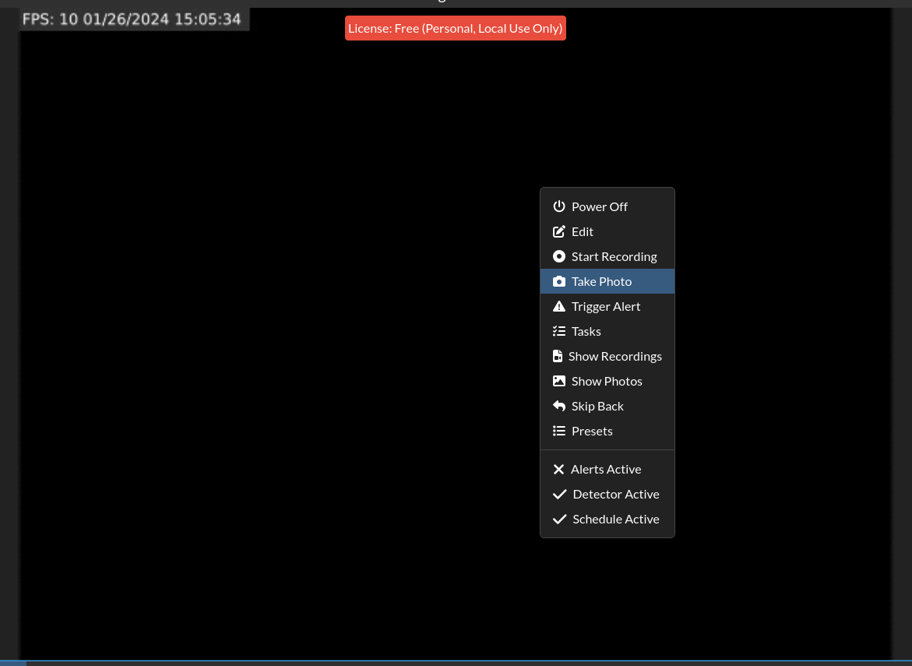

You should now have a root shell.

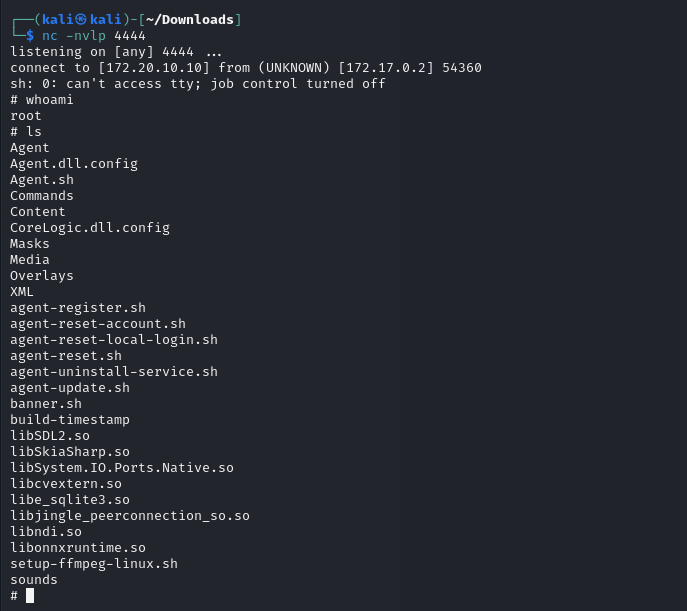
